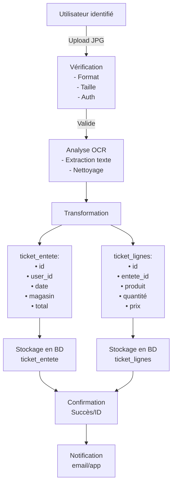

```mermaid
flowchart TD
    A[Utilisateur identifié] -->|Upload JPG| B[Vérification<br>- Format<br>- Taille<br>- Auth]
    B -->|Valide| C[Analyse OCR<br>- Extraction texte<br>- Nettoyage]
    C --> D[Transformation]
    D --> E["ticket_entete:<br>• id<br>• user_id<br>• date<br>• magasin<br>• total"]
    D --> F["ticket_lignes:<br>• id<br>• entete_id<br>• produit<br>• quantité<br>• prix"]
    E --> G[Stockage en BD<br>ticket_entete]
    F --> H[Stockage en BD<br>ticket_lignes]
    G --> I[Confirmation<br>Succès/ID]
    H --> I
    I --> J[Notification<br>email/app]

```