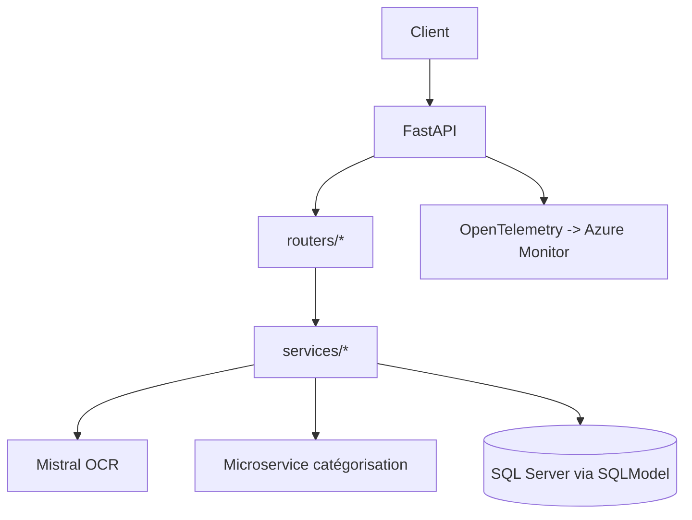

# 01 — Vue d’ensemble et objectifs

Cette application fournit une API pour:
- Recevoir des images de tickets de caisse (upload).
- Extraire et interpréter les informations (OCR + parsing).
- Catégoriser automatiquement les lignes produits.
- Persister les données structurées (entêtes et lignes de tickets) dans une base SQL Server.
- Exposer des endpoints de consultation (tickets, dépenses par catégorie).
- Gérer des entités annexes: clients, enseignes, catégories produits.

Technologies clés:
- FastAPI pour l’API.
- SQLModel (SQLAlchemy + Pydantic) pour les modèles persistés et les relations.
- Pydantic BaseModel pour les schémas d’échange (DTO).
- OpenTelemetry + Azure Monitor pour les métriques.
- Intégration OCR (Mistral) + microservice de catégorisation produit.

Navigation:
- Architecture: [02 — Architecture et organisation du code](./02_architecture.md)
- Modèles (SQLModel et BaseModel): [03 — Modélisation](./03_modeles_donnees.md)
- Pipeline complet: [04 — Pipeline d’ingestion](./04_pipeline_ingestion.md)
- Parsing (enseignes, fuzzy): [05 — Parsing par enseigne](./05_parsing_enseignes.md)
- Services: [06 — Services métiers](./06_services_metier.md)
- API: [07 — API et routes](./07_api_endpoints.md)
- DB/Config/Metrics: [08 — Base de données & métriques](./08_bdd_config_metrics.md)
- Qualité/Perf: [09 — Qualité & bonnes pratiques](./09_qualite_performance.md)
- Points d’attention: [10 — Points d’attention](./10_points_attention.md)
- Annexes: [11 — Annexes](./11_annexes.md)

Diagramme d’ensemble (composants):

Voir aussi: [Sommaire](./00_navigation.md) — [Architecture](./02_architecture.md)