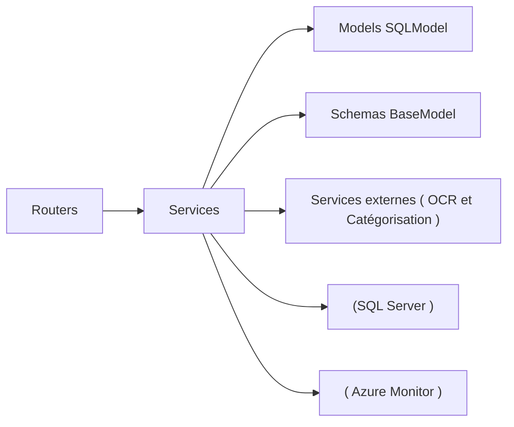

# 02 — Architecture et organisation du code

Organisation principale:
- app/main.py: point d’entrée FastAPI, cycle de vie (lifespan), injection de routes, pré-chargement de dictionnaires (enseignes, catégories).
- app/routers/: endpoints (tickets, clients, ...).
- app/services/: logique métier (ingestion, parsing, calculs et accès aux modèles).
- app/models/: modèles persistés (tables) via SQLModel.
- app/schemas/: schémas d’échange (DTO) via Pydantic/SQLModel.
- app/db/database.py: engine, session, construction de l’URL de connexion.
- app/metrics.py: instrumentation OpenTelemetry/Azure Monitor.
- app/config.py: récupération de la configuration via variables d’environnement.

Relations entre couches:

Points notables:
- Le lifespan précharge des dictionnaires en mémoire pour accélérer la résolution d’enseigne et la catégorisation (mapping nom→id).
- Les services isolent la logique métier et la persistence.
- Les schémas de réponse (Response DTO) encapsulent ce qui est renvoyé au client.

Navigation:
- Modèles: [03 — Modélisation](./03_modeles_donnees.md)
- Pipeline: [04 — Pipeline d’ingestion](./04_pipeline_ingestion.md)
- Services: [06 — Services métiers](./06_services_metier.md)

Voir aussi: [Sommaire](./00_navigation.md)