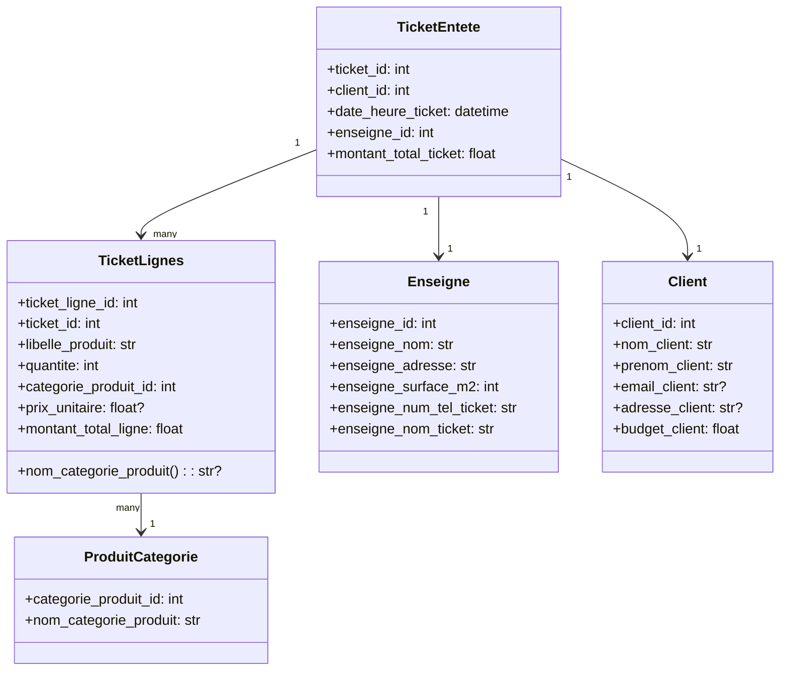

# 03 — Modélisation: SQLModel vs BaseModel

Pourquoi deux familles de modèles ?
- SQLModel (hérite de Pydantic + SQLAlchemy) pour les entités persistées et leurs relations.
- BaseModel Pydantic pour les objets d’échange transitoires (entrée/sortie API, modèles intermédiaires non stockés tels que les tickets interprétés issus de l’OCR).

Exemples SQLModel (persistés):
- app/models/ticket.py: TicketEntete, TicketLignes
- app/models/enseigne.py: Enseigne
- app/models/produit_categorie.py: ProduitCategorie
- app/models/client.py: Client

Exemples BaseModel/DTO (transitoires):
- app/schemas/ticket_interprete.py: TicketInterprete, LigneTicketInterpretee (résultat parsing OCR)
- app/schemas/ticket_reponse.py: TicketEnteteResponse, TicketLigneResponse (réponses API)
- app/schemas/client.py: ClientCreate, ClientUpdate (payloads)

Avantages:
- SQLModel: relations, contraintes, cohérence avec la base, type-safety.
- BaseModel: validation d’entrée/sortie, contrôle strict des contrats API, dissociation des schémas de transport et des entités persistées.

Diagramme de classes (simplifié, côté SQLModel):

Remarques importantes:
- Propriété calculée nom_categorie_produit dans TicketLignes s’appuie sur la relation catégorie.
- Les modèles Update (TicketEnteteUpdate, TicketLignesUpdate) lèvent une exception en __init__ pour interdire toute modification post création (invariants métiers).

Navigation:
- Pipeline: [04 — Pipeline d’ingestion](./04_pipeline_ingestion.md)
- Parsing: [05 — Parsing par enseigne](./05_parsing_enseignes.md)
- Services: [06 — Services métiers](./06_services_metier.md)

Voir aussi: [Sommaire](./00_navigation.md)