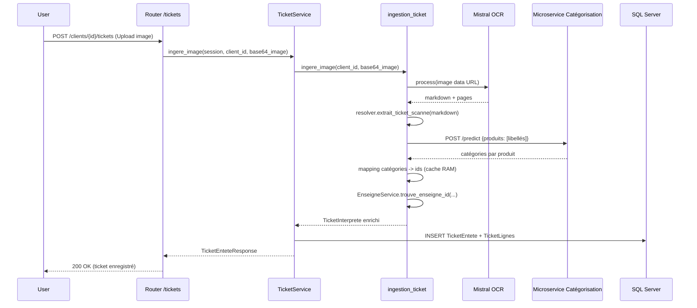

# 04 — Pipeline d’ingestion de tickets

Rôles principaux:
- OCR via Mistral (mistralai) pour obtenir un Markdown lisible.
- Sélection de la stratégie de parsing selon l’enseigne (resolver).
- Enrichissement:
  - Catégorisation des produits via microservice externe.
  - Résolution de l’enseigne (id) via matching flou.
- Persistence (entête + lignes) en base.

Code concerné:
- app/services/tickets/ingestion_ticket.py
- app/services/tickets/reconnaissance_tickets/resolver.py
- app/services/tickets/reconnaissance_tickets/enseignes/carrefour/*
- app/services/ticket_service.py (orchestration de la persistance)
- app/metrics.py (suivi erreurs/succès)

Séquence détaillée:

Gestion des erreurs:
- Compteurs OpenTelemetry (COMPTEUR_INGESTIONS_TICKET_ERREUR) incrémentés avec étiquettes: OCR impossible, catégorisation impossible, résolution enseigne impossible.
- COMPTEUR_TOTAL_INGESTIONS_TICKET compte les succès/échecs globaux.

Navigation:
- Parsing enseignes: [05 — Parsing par enseigne](./05_parsing_enseignes.md)
- Services: [06 — Services métiers](./06_services_metier.md)
- API: [07 — API et routes](./07_api_endpoints.md)

Voir aussi: [Sommaire](./00_navigation.md)