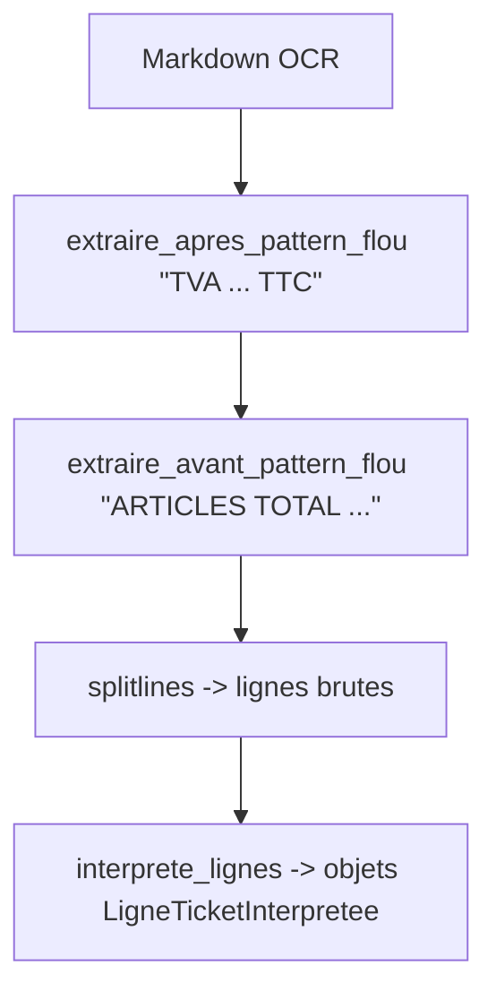

# 05 — Parsing par enseigne et extraction robuste

Sélection d’enseigne:
- app/services/tickets/reconnaissance_tickets/resolver.py:
  - Détecte "# city" ou "# market" au début du Markdown OCR pour router vers le parseur approprié.

Parseurs Carrefour:
- carrefour_city.py / carrefour_market.py:
  - Extraient nom enseigne (patterns regex dédiés).
  - Téléphone (trouve_tel_enseigne).
  - Date/heure (trouve_date_heure).
  - Lignes du tableau: isole_lignes_tableau + interprete_lignes.

Extraction robuste (bruit OCR):
- app/services/tickets/reconnaissance_tickets/extraction_fuzzy.py:
  - Matching flou basé sur Levenshtein pour extraire ce qui est avant/après des patterns clés:
    - "TVA DESCRIPTION QTE x P.U. MONTANT TTC"
    - "ARTICLE(S) TOTAL A PAYER"
  - Normalisation des espaces et pipes.

Interprétation des lignes:
- interprete_lignes utilise une regex tolérante pour parser:
  - Col1: taux TVA (peut être vide).
  - Col2: libellé produit.
  - Col3: « qte x pu » optionnelle.
  - Col4: montant (avec ou sans symbole €).

Diagramme de flux (extraction tableau):

Points d’attention (voir détails en [10 — Points d’attention](./10_points_attention.md)):
- Si parsing de « q x pu » échoue, prévoir des valeurs par défaut pour qte/pu avant l’append.
- Les regex de nom d’enseigne sont spécifiques aux formats Carrefour; ajouter des parseurs pour d’autres enseignes.

Navigation:
- Pipeline: [04 — Pipeline d’ingestion](./04_pipeline_ingestion.md)
- Modèles: [03 — Modélisation](./03_modeles_donnees.md)

Voir aussi: [Sommaire](./00_navigation.md)