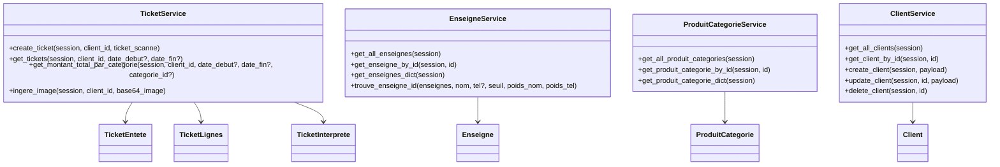

# 06 — Services métiers

Aperçu:
- TicketService (app/services/ticket_service.py): persistence, requêtes et agrégations.
- ingestion_ticket (app/services/tickets/ingestion_ticket.py): OCR, catégorisation, résolution enseigne.
- EnseigneService (app/services/enseigne_service.py): accès enseignes + matching flou.
- ProduitCategorieService (app/services/produit_categorie_service.py): accès catégories + dictionnaire mémoire.
- ClientService (app/services/client_service.py): CRUD clients.

Diagramme de classes (services → modèles/schémas):

Détails clés:
- TicketService.create_ticket:
  - Transforme TicketInterprete (DTO) en TicketEntete/TicketLignes (SQLModel).
  - Utilise model_validate pour garantir la cohérence.
- TicketService.get_tickets:
  - Récupère les lignes par ticket, joint la catégorie (selectinload) et renvoie des DTO de réponse.
- TicketService.get_montant_total_par_categorie:
  - Calcule un SUM sur les lignes filtrées par période et catégorie.
- ingestion_ticket.ingere_image:
  - Enchaîne OCR → catégorisation → résolution enseigne. Incrémente les métriques d’erreurs si besoin.

Navigation:
- API: [07 — API et routes](./07_api_endpoints.md)
- DB/Config/Metrics: [08 — Base & métriques](./08_bdd_config_metrics.md)
- Points d’attention: [10 — Points d’attention](./10_points_attention.md)

Voir aussi: [Sommaire](./00_navigation.md)