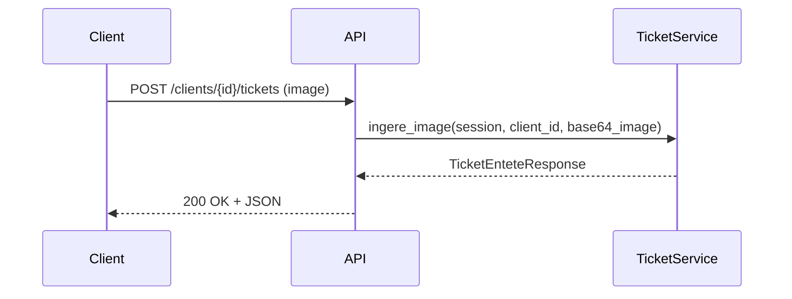
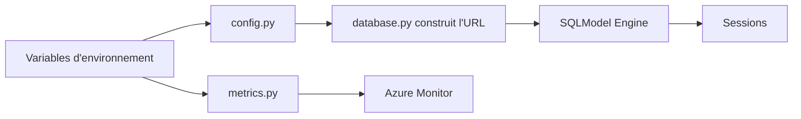

# 07 — API et routes exposées

Routers principaux:
- app/routers/ticket.py
  - POST /clients/{client_id}/tickets: upload image, ingestion complète.
  - POST /clients/{client_id}/tickets_tmp: création directe depuis un TicketInterprete (test).
  - GET /clients/{client_id}/tickets: liste des tickets (filtre par dates).
  - GET /clients/{client_id}/depenses: agrégat montant total par catégorie/période.
- app/routers/clients.py (CRUD clients): endpoints définis mais import de session à corriger (voir points d’attention).

Contrats de réponse:
- TicketEnteteResponse et TicketLigneResponse (app/schemas/ticket_reponse.py).

Séquence d’appel (upload ticket):



Paramètres et validation:
- upload_ticket_image vérifie le content-type du fichier (image/*).
- get_tickets et get_depenses_par_categorie acceptent des filtres de dates et d’ids.

Navigation:
- Pipeline: [04 — Pipeline d’ingestion](./04_pipeline_ingestion.md)
- Services: [06 — Services métiers](./06_services_metier.md)
- Points d’attention: [10 — Points d’attention](./10_points_attention.md)

Voir aussi: [Sommaire](./00_navigation.md)
```

````markdown name=08_bdd_config_metrics.md
# 08 — Base de données, configuration et métriques

Base de données:
- SQL Server via SQLModel/SQLAlchemy (pyodbc).
- engine créé dans app/db/database.py.
- get_session() fournit une session par requête (dépendance FastAPI).

Construction de l’URL (database.py):
- Utilise app/config.py pour récupérer:
  - DB_USER, DB_PASSWORD, DB_SERVER, DB_PORT, DB_NAME.
  - DB_DRIVER (ex: "ODBC Driver 18 for SQL Server").
  - TRUST_SERVER_CERTIFICATE (yes/no).

Métriques (app/metrics.py):
- OpenTelemetry MeterProvider avec exporteur Azure Monitor.
- Compteurs:
  - COMPTEUR_TOTAL_INGESTIONS_TICKET: succès/échec global ingestion.
  - COMPTEUR_INGESTIONS_TICKET_ERREUR: causes détaillées côté OCR/catégorisation/résolution.

Initialisation (app/main.py):
- lifespan:
  - Charge en RAM deux dictionnaires:
    - enseignes_dict: {enseigne_id → (nom_ticket, tel_ticket)}
    - produit_categorie_dict: {nom_categorie → id}
  - Objectif: booster la performance au moment du parsing.

Diagramme (config → DB → metrics):



Navigation:
- Architecture: [02 — Architecture](./02_architecture.md)
- Services: [06 — Services métiers](./06_services_metier.md)
- Qualité/Perf: [09 — Qualité & performances](./09_qualite_performance.md)

Voir aussi: [Sommaire](./00_navigation.md)