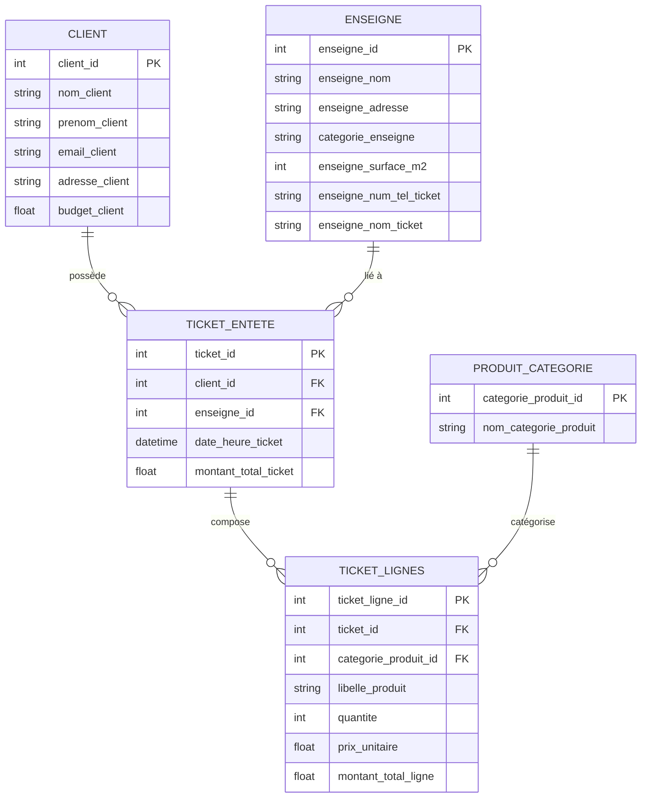

# 11 — Annexes: schémas de données et exemples

Schéma entités/relations (ER):



Exemple d’objet TicketInterprete (entrée depuis OCR + enrichissements):

```json
{
  "nom_enseigne": "Carrefour City Paris X",
  "enseigne_id": 12,
  "tel_enseigne": "01 23 45 67 89",
  "date_heure_ticket": "2024-08-18T16:03:00",
  "montant_total_ticket": 37.50,
  "lignes": [
    {"taux_tva": 5, "libelle_produit": "Baguette", "qte": 2, "categorie_produit_id": 3, "pu": 1.25, "montant": 2.5},
    {"taux_tva": 20, "libelle_produit": "Lait", "qte": 1, "categorie_produit_id": 4, "pu": 1.10, "montant": 1.10}
  ]
}
```

Exemple de réponse API (TicketEnteteResponse):

```json
{
  "ticket_id": 123,
  "client_id": 1,
  "date_heure_ticket": "2024-08-18T16:03:00Z",
  "enseigne_id": 12,
  "montant_total_ticket": 37.5,
  "lignes": [
    {
      "ticket_ligne_id": 789,
      "libelle_produit": "Baguette",
      "quantite": 2,
      "categorie_produit_id": 3,
      "nom_categorie_produit": "Boulangerie",
      "prix_unitaire": 1.25,
      "montant_total_ligne": 2.5
    }
  ]
}
```

Liens utiles:
- Modèles & schémas: [03 — Modélisation](./03_modeles_donnees.md)
- API: [07 — API & routes](./07_api_endpoints.md)
- Pipeline: [04 — Pipeline d’ingestion](./04_pipeline_ingestion.md)

Voir aussi: [Sommaire](./00_navigation.md)