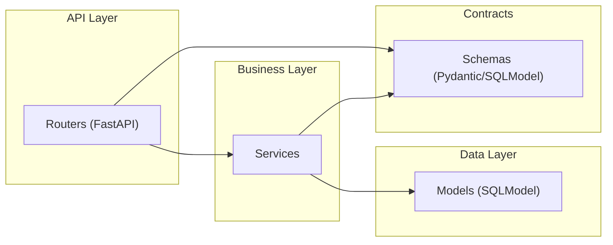

# Séparation claire routers / services / models / schemas

Cette section détaille la séparation des responsabilités entre les couches de l’application, pourquoi elle est essentielle, comment elle est appliquée dans ce projet, et comment l’améliorer encore. Elle s’appuie sur les fichiers fournis et propose des exemples, bonnes pratiques et anti‑patterns à éviter.

Liens utiles:
- Architecture générale: 02 — Architecture et organisation du code (./02_architecture.md)
- Modélisation: 03 — Modélisation: SQLModel vs BaseModel (./03_modeles_donnees.md)
- Services métiers: 06 — Services métiers (./06_services_metier.md)
- API et routes: 07 — API et routes exposées (./07_api_endpoints.md)

## Objectif de la séparation

- Maintenabilité: chaque couche a une responsabilité unique.
- Testabilité: tests unitaires ciblés (routes, services, parsing, persistance).
- Évolutivité: modifications locales (ex. changer l’OCR) sans impacter les contrôleurs.
- Sécurité et robustesse: contrats d’API (schemas) stables, persistance encapsulée.



Principes de dépendances (sens permis):
- routers → services → models
- routers ↔ schemas et services ↔ schemas
- models n’importent pas routers ni services
- services n’importent pas routers

## Rôles par couche

- Routers (app/routers/*):
  - Reçoivent la requête HTTP, valident l’entrée via des schemas.
  - Orchestrent les dépendances (ex. get_session()).
  - Appellent les services et retournent des schemas de réponse.
  - Ne contiennent pas de logique métier ni d’ORM direct.

- Services (app/services/*):
  - Portent la logique métier (création de tickets, agrégations, OCR, catégorisation).
  - Accèdent à la base via les models SQLModel (au travers d’une Session passée en paramètre).
  - Composent/décomposent des DTO (schemas) pour les I/O.

- Models (app/models/*, SQLModel):
  - Définissent les tables, colonnes, relations, contraintes.
  - N’ont pas de logique métier (hors propriétés calculées locales).
  - Restent découplés de FastAPI.

- Schemas (app/schemas/*, Pydantic BaseModel/SQLModel sans table=True):
  - Définissent les contrats d’entrée/sortie (DTO).
  - Décorrèlent les payloads API des entités persistées (évite d’exposer les colonnes internes).

## Application dans ce projet

- Routers:
  - app/routers/ticket.py expose POST/GET et délègue à TicketService.
  - app/routers/clients.py expose un CRUD (voir points d’attention sur les imports et les noms de champs).

- Services:
  - TicketService orchestre persistance, lecture et calculs d’agrégats.
  - ingestion_ticket (OCR + catégorisation + résolution enseigne) prépare un TicketInterprete (schema) pour la persistance.
  - ProduitCategorieService et EnseigneService fournissent des accès rapides (dicts en mémoire) et séparent l’accès DB.

- Models:
  - TicketEntete, TicketLignes, ProduitCategorie, Enseigne, Client (SQLModel).
  - Relations déclarées (ex. TicketEntete.lignes, TicketLignes.categorie).

- Schemas:
  - ticket_interprete.py (DTO côté parsing/OCR).
  - ticket_reponse.py (DTO de réponse publique).
  - client.py (DTOs de création/mise à jour; voir alignement des champs).

## Exemple « de bout en bout » (POST /tickets)

Router (extrait simplifié — app/routers/ticket.py):
```python
@router.post("/clients/{client_id}/tickets", response_model=TicketEnteteResponse)
async def upload_ticket_image(client_id: int, file: UploadFile = File(...), session: Session = Depends(get_session)):
    if not file.content_type.startswith("image/"):
        raise HTTPException(status_code=400, detail="Le fichier doit être une image.")
    base64_image = base64.b64encode(await file.read()).decode("utf-8")
    ticket = TicketService.ingere_image(session, client_id, base64_image)
    if not ticket:
        raise HTTPException(status_code=400, detail="Erreur lors de l'ingestion.")
    return ticket  # DTO de réponse ou objet compatible avec response_model
```

Service (extrait — app/services/ticket_service.py):
```python
def create_ticket(session: Session, client_id: int, ticket_scanne: TicketInterprete) -> TicketEntete | None:
    ticket_entete = TicketEnteteCreate(
        client_id=client_id,
        enseigne_id=ticket_scanne.enseigne_id,
        date_heure_ticket=ticket_scanne.date_heure_ticket,
        montant_total_ticket=ticket_scanne.montant_total_ticket,
    )
    db_ticket = TicketEntete.model_validate(ticket_entete)
    session.add(db_ticket)
    session.commit()
    session.refresh(db_ticket)
    # ... créer et ajouter TicketLignes à partir de ticket_scanne.lignes ...
    return db_ticket
```

Models (extrait — app/models/ticket.py):
```python
class TicketEntete(TicketEnteteBase, table=True):
    ticket_id: Optional[int] = Field(default=None, primary_key=True)
    lignes: List["TicketLignes"] = Relationship(back_populates="ticket")
    __tablename__ = "TicketEntetes"
    __table_args__ = {"schema": "achats"}
```

Schemas (extrait — app/schemas/ticket_interprete.py):
```python
class TicketInterprete(BaseModel):
    nom_enseigne: Optional[str] = None
    enseigne_id: Optional[int] = None
    tel_enseigne: Optional[str] = None
    date_heure_ticket: Optional[datetime] = None
    montant_total_ticket: Optional[float] = None
    lignes: List[LigneTicketInterpretee] = []
```

## Bonnes pratiques

- Routers:
  - Ne jamais manipuler d’instances SQLModel directement; travailler avec des schemas (DTO).
  - Convertir/prévalider les paramètres (ex. dates) avant d’appeler le service.
  - Laisser la Session (get_session) en dépendance injectée et la transmettre au service.

- Services:
  - Encapsuler la logique (OCR, categorisation, calcul d’agrégats) ici.
  - Ne pas lever d’HTTPException; lever des exceptions métier ou renvoyer None/Result. Les routers traduisent en codes HTTP.
  - Centraliser la transformation Models ↔ Schemas.

- Models:
  - Garder les models « anémiques » (pas de logique métier complexe).
  - Définir clairement les relations et propriétés calculées locales (ex. nom_categorie_produit).
  - Éviter d’introduire des dépendances vers FastAPI ou des services.

- Schemas:
  - Différencier clairement Request DTO, Response DTO, DTO internes (parseurs/OCR).
  - Ne pas faire dépendre les DTO publics des entités SQL (évite d’exposer des colonnes sensibles).
  - Valider les types (ex. datetime plutôt que str) pour réduire les ambigüités.

## Anti‑patterns courants (à éviter)

- Mélanger des entités SQLModel avec les DTO dans les routers.  
  → Risque d’exposer des colonnes internes et de coupler l’API à la structure DB.

- Se reposer sur from_orm avec des noms de champs divergents entre DTO et Models.  
  → Préférer des mappings explicites (ex. ClientCreate.nom → Client.nom_client).

- Lever HTTPException dans les services.  
  → Couplage à FastAPI, rend les services moins testables.

- Accéder directement à des services externes (OCR, catégorisation) depuis les routers.  
  → Logique hors du contrôleur; faire via ingestion_ticket/TicketService.

## Tests par couche

- Routers:
  - Test des codes HTTP, des validations de payload, des schémas de réponse.
  - Mock des services.

- Services:
  - Test logique métier (catégorisation, agrégations, parsing).  
  - Utilisation de DB de test ou mock de Session selon le cas.

- Models:
  - Test de mapping et contraintes (FK, not null, relations).

- Schemas:
  - Test de validation (types, champs requis, valeurs par défaut).

## Améliorations ciblées dans ce repo

- Aligner les noms ClientCreate/ClientUpdate avec Client (nom_client vs nom).  
  → Introduire un mapping ou renommer les champs DTO pour cohérence.

- Harmoniser les types date_debut/date_fin: router (str) vs service (datetime).  
  → Parser dans le router ou accepter des str dans le service et convertir.

- Unifier TicketInterprete (doublon entre app/schemas et app/services/tickets/reconnaissance_tickets/model_ticket.py).  
  → Garder un seul module source de vérité.

- Déplacer la traduction des erreurs techniques des services vers les routers.  
  → Les services retournent des résultats/erreurs métiers; les routers mappent en HTTPException.

- Ajouter timeouts et gestion de retry dans ingestion_ticket pour les appels réseau.

## Checklist d’implémentation

- [ ] Les routers n’importent aucun model SQLModel; uniquement des schemas et services.
- [ ] Les services n’importent pas fastapi.*; aucun HTTPException.
- [ ] Les models n’importent ni services ni routers.
- [ ] Les schemas sont les seuls objets exposés à l’interface HTTP.
- [ ] Les transformations Models ↔ Schemas sont centralisées dans les services.
- [ ] Les dépendances (Session) sont injectées par les routers, transmises aux services.
- [ ] Les services externes (OCR/Catégorisation) ne sont appelés que depuis les services.

Voir aussi:
- 06 — Services métiers (./06_services_metier.md)
- 03 — Modélisation (./03_modeles_donnees.md)
- 07 — API et routes (./07_api_endpoints.md)
- Sommaire (./00_navigation.md)