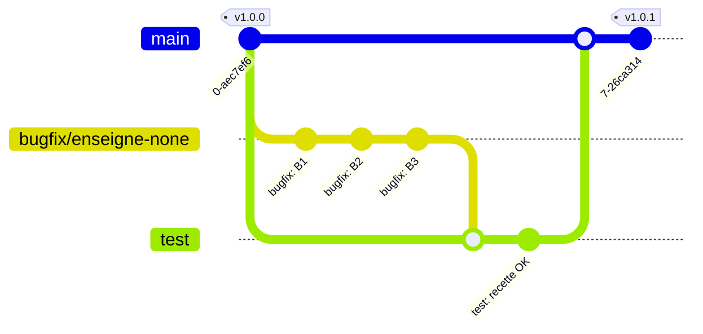
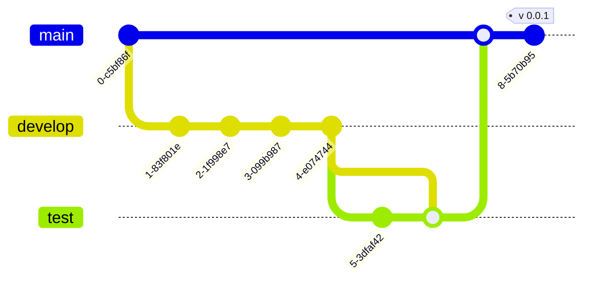

```mermaid
gitGraph
   commit tag: "v1.0.0"
   branch bugfix/enseigne-none
   checkout bugfix/enseigne-none
   commit id: "bugfix: B1"
   commit id: "bugfix: B2"
   commit id: "bugfix: B3"
   checkout main
   branch test
   checkout test
   merge bugfix/enseigne-none
   commit id: "test: recette OK"
   checkout main
   merge test
   commit tag: "v1.0.1"
```

```mermaid
gitGraph
   commit 
   branch develop
   checkout develop
   commit
   commit
   commit
   commit
   branch test
   checkout test
   commit
   merge develop
   checkout main
   merge test
   commit tag: "v 0.0.1"
```