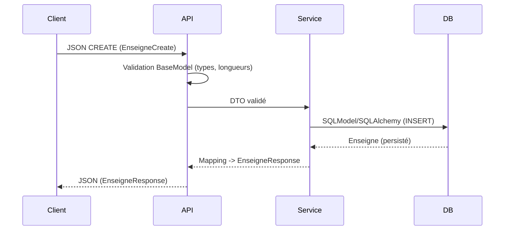

# Enseignes — De la table SQL à Pydantic (BaseModel) et SQLModel

Ce document illustre, à partir d’une table SQL réelle, comment modéliser proprement la donnée côté application en combinant:
- des modèles de persistance avec SQLModel (adossés à SQLAlchemy),
- des schémas d’échange (DTO) avec Pydantic BaseModel.

Table source (SQL Server):
```sql
CREATE TABLE achats.Enseignes
(
    enseigne_id INT IDENTITY(1,1) PRIMARY KEY,
    enseigne_nom NVARCHAR(200) NOT NULL,
    enseigne_adresse NVARCHAR(300) NULL,
    categorie_enseigne NVARCHAR(20) NULL,
    enseigne_surface_m2 INT DEFAULT 0,
    enseigne_num_tel_ticket NVARCHAR(300) NULL,
    enseigne_nom_ticket NVARCHAR(200) NULL
);
```

Objectifs:
- refléter fidèlement ce schéma en SQLModel (types, nullabilité, défauts),
- définir des DTO Pydantic clairs pour l’API (Create/Update/Response),
- montrer les points d’attention (longueurs, valeurs par défaut, conversions),
- donner un exemple de CRUD minimal.

---

## 1) Modélisation de la table avec SQLModel (persistance)

Ici, on exprime la table achats.Enseignes sous forme de modèle SQLModel: on indique le schema, les longueurs max (pour la colonne), la clé primaire, et les champs optionnels (NULL en SQL).

```python
from typing import Optional
from sqlmodel import SQLModel, Field

class EnseigneBase(SQLModel):
    # NOT NULL en base -> champ requis (str sans Optional)
    enseigne_nom: str = Field(max_length=200)

    # NULL en base -> champ optionnel côté modèle (Optional[str] = None)
    enseigne_adresse: Optional[str] = Field(default=None, max_length=300)
    categorie_enseigne: Optional[str] = Field(default=None, max_length=20)

    # DEFAULT 0 en base -> valeur par défaut côté modèle
    enseigne_surface_m2: int = Field(default=0)

    # NULL en base -> optionnel
    enseigne_num_tel_ticket: Optional[str] = Field(default=None, max_length=300)
    enseigne_nom_ticket: Optional[str] = Field(default=None, max_length=200)


class Enseigne(EnseigneBase, table=True):
    enseigne_id: Optional[int] = Field(default=None, primary_key=True)

    __tablename__ = "Enseignes"
    __table_args__ = {"schema": "achats"}
```

Notes:
- Field(max_length=...) pousse l’info vers SQLAlchemy (colonne NVARCHAR(N)).
- Optional[str] = None reflète bien la nullabilité SQL.
- La valeur par défaut côté Python (default=0) s’aligne avec DEFAULT 0 en base (utile même si la base la fournit).

---

## 2) Schémas d’API avec Pydantic (BaseModel)

Séparer “ce qu’on stocke” (SQLModel) de “ce qu’on échange” (DTO) permet d’avoir:
- des contrats stables pour l’API,
- des validations dédiées (ex: formats),
- une indépendance vis‑à‑vis des détails de la base.

Exemple simple de DTO en Pydantic (v2):

```python
from typing import Optional
from pydantic import BaseModel, constr, Field as PydField

class EnseigneCreate(BaseModel):
    # Champs attendus à la création (sans l’ID)
    enseigne_nom: constr(max_length=200)
    enseigne_adresse: Optional[constr(max_length=300)] = None
    categorie_enseigne: Optional[constr(max_length=20)] = None
    enseigne_surface_m2: int = PydField(default=0, ge=0)  # contrainte métier simple
    enseigne_num_tel_ticket: Optional[constr(max_length=300)] = None
    enseigne_nom_ticket: Optional[constr(max_length=200)] = None


class EnseigneUpdate(BaseModel):
    # Tous optionnels pour le PATCH/PUT partiel
    enseigne_nom: Optional[constr(max_length=200)] = None
    enseigne_adresse: Optional[constr(max_length=300)] = None
    categorie_enseigne: Optional[constr(max_length=20)] = None
    enseigne_surface_m2: Optional[int] = PydField(default=None, ge=0)
    enseigne_num_tel_ticket: Optional[constr(max_length=300)] = None
    enseigne_nom_ticket: Optional[constr(max_length=200)] = None


class EnseigneResponse(BaseModel):
    # Ce que l’API renvoie au client
    enseigne_id: int
    enseigne_nom: str
    enseigne_adresse: Optional[str] = None
    categorie_enseigne: Optional[str] = None
    enseigne_surface_m2: int
    enseigne_num_tel_ticket: Optional[str] = None
    enseigne_nom_ticket: Optional[str] = None
```

Pourquoi des DTO séparés?
- On évite d’exposer des colonnes ajoutées à la base (ou internes) par inadvertance.
- On peut faire évoluer la base sans casser l’API (et inversement).
- On ajoute des validations “métier” spécifiques à l’API (ex: ge=0).

---

## 3) Service (extraits): mapping DTO ↔ SQLModel et CRUD

Exemple minimal d’usage avec SQLModel + Session.  
Le mapping est explicite (lisible et robuste).

```python
from typing import List, Optional
from sqlmodel import Session, select
from fastapi import HTTPException

def create_enseigne(session: Session, payload: EnseigneCreate) -> Enseigne:
    db_obj = Enseigne(**payload.model_dump())
    session.add(db_obj)
    session.commit()
    session.refresh(db_obj)
    return db_obj

def get_enseigne_by_id(session: Session, enseigne_id: int) -> Enseigne:
    obj = session.get(Enseigne, enseigne_id)
    if not obj:
        raise HTTPException(status_code=404, detail="Enseigne non trouvée")
    return obj

def list_enseignes(session: Session) -> List[Enseigne]:
    return session.exec(select(Enseigne)).all()

def update_enseigne(session: Session, enseigne_id: int, payload: EnseigneUpdate) -> Enseigne:
    db_obj = session.get(Enseigne, enseigne_id)
    if not db_obj:
        raise HTTPException(status_code=404, detail="Enseigne non trouvée")

    updates = payload.model_dump(exclude_unset=True)
    for k, v in updates.items():
        setattr(db_obj, k, v)

    session.add(db_obj)
    session.commit()
    session.refresh(db_obj)
    return db_obj

def delete_enseigne(session: Session, enseigne_id: int) -> None:
    db_obj = session.get(Enseigne, enseigne_id)
    if not db_obj:
        raise HTTPException(status_code=404, detail="Enseigne non trouvée")
    session.delete(db_obj)
    session.commit()
```

Transformation pour la réponse API:
```python
def to_response(obj: Enseigne) -> EnseigneResponse:
    return EnseigneResponse(
        enseigne_id=obj.enseigne_id,
        enseigne_nom=obj.enseigne_nom,
        enseigne_adresse=obj.enseigne_adresse,
        categorie_enseigne=obj.categorie_enseigne,
        enseigne_surface_m2=obj.enseigne_surface_m2,
        enseigne_num_tel_ticket=obj.enseigne_num_tel_ticket,
        enseigne_nom_ticket=obj.enseigne_nom_ticket,
    )
```

---

## 4) Positions respectives dans l’application

Schéma de circulation des données:



- BaseModel (DTO): en bordure (entrée/sortie HTTP), garantit les contrats.
- SQLModel: au cœur (persistance / requêtes), adossé à SQLAlchemy (Engine, Session, select, etc.).

---

## 5) Points d’attention (DDL ↔ modèles)

- Nullabilité:
  - Toute colonne SQL NULL doit être Optional[...] = None côté SQLModel (et DTO si exposée).
  - Ici: adresse, catégorie, tel, nom_ticket sont optionnels.

- Valeurs par défaut:
  - DEFAULT 0 (enseigne_surface_m2) → prévoir default=0 côté modèle ET DTO pour cohérence applicative.

- Longueurs NVARCHAR:
  - Field(max_length=...) côté SQLModel assure la colonne correcte.
  - Pour valider aussi côté API, utiliser des types contraints Pydantic (constr(max_length=...)) dans les DTO.

- Conventions de nommage:
  - Garder les mêmes noms favorise un mapping simple (**payload.model_dump()** → **Enseigne(**...**)**).
  - Si l’API a d’autres noms (ex. “name”), écrire un mapping explicite.

- Migrations:
  - SQLModel n’assure pas les migrations de schéma. Utiliser Alembic pour générer/appliquer les migrations (ALTER TABLE, etc.).

---

## 6) Exemple rapide de lecture “clé → tuple” (cache mémoire)

Utile pour des résolutions rapides (ex. par similarité):

```python
from typing import Dict, Tuple

def get_enseignes_dict(session: Session) -> Dict[int, Tuple[str, Optional[str]]]:
    stmt = select(Enseigne.enseigne_id, Enseigne.enseigne_nom_ticket, Enseigne.enseigne_num_tel_ticket)
    rows = session.exec(stmt)
    return {eid: (nom_ticket, tel_ticket) for eid, nom_ticket, tel_ticket in rows}
```

---

## 7) Résumé

- SQLModel reflète la table SQL: types, nullabilité, relations, et s’appuie sur SQLAlchemy pour les sessions et requêtes.
- Pydantic BaseModel définit les contrats d’API (entrées/sorties), avec des validations dédiées (longueurs, bornes, formats).
- La séparation DTO ↔ Entités persistées clarifie les responsabilités, stabilise l’API et facilite les évolutions de la base.
- Le mapping entre les deux se fait dans la couche service, de manière explicite et testable.