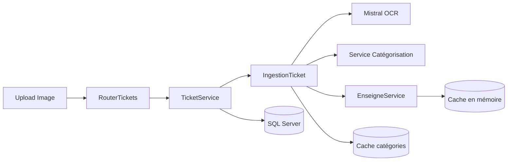
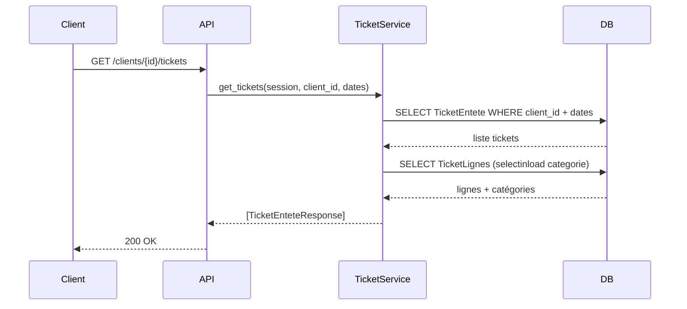

# Focus — Diagrammes ciblés (sélection complémentaire)

Composants ingestion:

Séquence récupération tickets et lignes:

Voir:
- Pipeline: [04 — Pipeline d’ingestion](./04_pipeline_ingestion.md)
- Services: [06 — Services métiers](./06_services_metier.md)