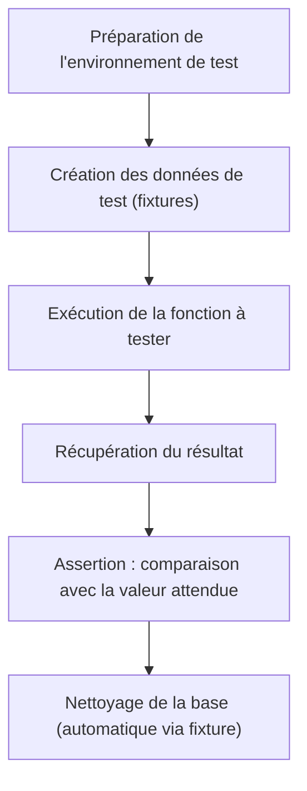

# Guide pratique : Mettre en place une démarche de test pour un projet Python

Ce document présente une démarche de test adaptée à un projet Python, avec exemples concrets issus d'un projet réel. Il propose une structure d'organisation, des bonnes pratiques et des illustrations, afin de favoriser la robustesse et la maintenabilité du code.

---

## Table des matières

- [Guide pratique : Mettre en place une démarche de test pour un projet Python](#guide-pratique--mettre-en-place-une-démarche-de-test-pour-un-projet-python)
  - [Table des matières](#table-des-matières)
  - [1. Pourquoi tester ?](#1-pourquoi-tester-)
  - [2. Organisation des tests](#2-organisation-des-tests)
  - [3. Écriture des tests unitaires et d'intégration](#3-écriture-des-tests-unitaires-et-dintégration)
    - [3.1. Structure des fichiers](#31-structure-des-fichiers)
    - [3.2. Exemple de test d'intégration base de données](#32-exemple-de-test-dintégration-base-de-données)
    - [3.3. Utilisation des fixtures Pytest](#33-utilisation-des-fixtures-pytest)
  - [4. Bonnes pratiques](#4-bonnes-pratiques)
  - [5. Flux typique d'un test d'intégration](#5-flux-typique-dun-test-dintégration)
  - [6. Exemples complémentaires](#6-exemples-complémentaires)
    - [Test de parsing de documents (test de service)](#test-de-parsing-de-documents-test-de-service)
    - [Test d’ingestion d’image (fonctionnelle)](#test-dingestion-dimage-fonctionnelle)
  - [7. Validation humaine avec curl](#7-validation-humaine-avec-curl)
    - [Exemples de requêtes curl](#exemples-de-requêtes-curl)
      - [Upload d'une image de ticket (POST)](#upload-dune-image-de-ticket-post)
      - [Récupération de la liste des tickets (GET)](#récupération-de-la-liste-des-tickets-get)
  - [8. Références](#8-références)

---

## 1. Pourquoi tester ?

Les tests automatisés permettent de garantir que le code fonctionne comme attendu, de prévenir les régressions et d'accélérer l'évolution du projet. Ils facilitent aussi la documentation des comportements attendus.

---

## 2. Organisation des tests

L'organisation adoptée sépare les tests du code source dans un dossier `tests/` à la racine du projet. Ce dossier peut contenir des sous-dossiers par domaine fonctionnel (ex. `database/`, `reconnaissance_tickets/`).

**Exemple de structure :**
```
projet/
│
├── app/
│   └── ...           # Code source
├── tests/
│   ├── __init__.py
│   ├── ingestion_ticketTest.py
│   ├── database/
│   │   ├── __init__.py
│   │   ├── test_create_ticket.py
│   │   ├── test_get_tickets.py
│   │   └── pyodbc_tickets_utils.py
│   └── reconnaissance_tickets/
│       └── test_resolver.py
```

---

## 3. Écriture des tests unitaires et d'intégration

### 3.1. Structure des fichiers

- Chaque fichier de test commence par `test_` ou se termine par `Test.py`.
- Les tests utilisant une base de données s'appuient sur des utilitaires pour créer, insérer, ou nettoyer les données (`pyodbc_tickets_utils.py`, `conftest.py`).

### 3.2. Exemple de test d'intégration base de données

Un test typique consiste à :
- Insérer des données de test
- Appeler la fonction à tester
- Vérifier que la sortie correspond à l’attendu

```python
def test_get_tickets(session, simple_ticket_interprete):
    client_id = 10
    insere_ticket(simple_ticket_interprete, client_id)
    tickets = TicketService.get_tickets(session, client_id=client_id)
    assert len(tickets) == 1
    # Comparaison personnalisée pour ignorer certains champs non pertinents
    assert compare_ignorant_ticket_ligne_id(
        tickets[0],
        TicketEnteteResponse(
            ticket_id=tickets[0].ticket_id,
            client_id=client_id,
            date_heure_ticket="2025-07-03T16:47:52",
            ...
        ),
    )
```

### 3.3. Utilisation des fixtures Pytest

Les fixtures permettent de factoriser la préparation de l’environnement de test (ex. : création de la base, nettoyage, récupération de sessions).

Exemple :  
```python
@pytest.fixture(scope="function")
def session(cree_database):
    engine = create_engine(...)
    with Session(engine) as session:
        yield session
```
Ceci évite de devoir répéter la configuration dans chaque test.

---

## 4. Bonnes pratiques

- **Isolation** : chaque test doit être indépendant ; il ne doit ni dépendre ni affecter les autres.
- **Données réalistes** : utiliser des exemples proches des cas réels pour augmenter la pertinence.
- **Comparaison souple** : ignorer dans les assertions certains champs générés dynamiquement (ex : identifiants).
- **Automatisation** : exécuter les tests via un outil d’intégration continue (CI).
- **Logs** : utiliser le logging pour faciliter le débogage sans polluer la sortie standard des tests.
- **Utilisation de `pytest.mark.parametrize`** pour tester plusieurs cas en boucle, par exemple pour tester différents formats de tickets scannés.

---

## 5. Flux typique d'un test d'intégration

Voici un diagramme Mermaid illustrant le flux général d'un test d'intégration sur la base de données :



---

## 6. Exemples complémentaires

### Test de parsing de documents (test de service)

```python
@pytest.mark.parametrize("markdown,expected_ticket", load_test_cases())
def test_extrait_ticket_scanne(markdown, expected_ticket):
    resultat = extrait_ticket_scanne(markdown)
    if expected_ticket is None:
        assert resultat is None
    else:
        assert resultat.model_dump() == expected_ticket.model_dump()
```
*Ici, on vérifie que le service d’extraction interprète correctement différents formats de tickets, ou retourne None si le ticket est non-reconnu.*

### Test d’ingestion d’image (fonctionnelle)

```python
def test_ingere_image():
    base64_image = encode_image("images/carrefour_market_1.jpeg")
    resultat = ingere_image(1, base64_image)
    assert resultat is not None  # ou d'autres assertions selon le besoin
```

---

## 7. Validation humaine avec curl

Même avec des tests automatisés, il peut être utile de valider manuellement certains scénarios via des appels HTTP directs. `curl` permet de simuler des requêtes API depuis la ligne de commande, par exemple lors de développements locaux ou de recettes.
<br>Les tests peuvent aussi se faire via l'intergace openApi proposée par FastAPI.

### Exemples de requêtes curl

#### Upload d'une image de ticket (POST)

```bash
curl -X POST http://localhost:8000/clients/123/tickets \
  -H "accept: application/json" \
  -H "Content-Type: multipart/form-data" \
  -F "file=@tests/reconnaissance_tickets/data/source/carrefour_city_1.jpg"
```
*Envoie une image pour traitement et création d'un ticket pour le client 12.*

#### Récupération de la liste des tickets (GET)

```bash
curl -X GET "http://localhost:8000/clients/12/tickets" \
  -H "accept: application/json"
```
*Récupère la liste des tickets associés au client 12.*

---

## 8. Références

- [Pytest Documentation](https://docs.pytest.org/)
- [pytest fixtures](https://docs.pytest.org/en/stable/how-to/fixtures.html)
- [Python logging](https://docs.python.org/3/library/logging.html)
- [Mermaid diagrams](https://mermaid-js.github.io/mermaid/#/)
- [Guide curl](https://curl.se/docs/manual.html)

---

> La mise en place d’une démarche de test structurée contribue de façon décisive à la qualité et à la pérennité des projets Python. Cette démarche peut être adaptée selon la taille du projet et ses contraintes spécifiques.