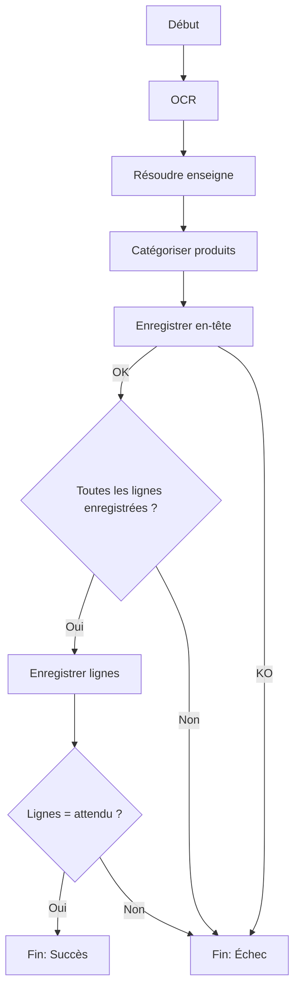

```mermaid
flowchart TD
    A[Début] --> B[OCR]
    B --> C[Résoudre enseigne]
    C --> D[Catégoriser produits]
    D --> E[Enregistrer en-tête]

    E -->|OK| F{Toutes les lignes enregistrées ?}
    E -->|KO| G[Fin: Échec]

    F -->|Oui| H[Enregistrer lignes]
    F -->|Non| G

    H --> I{Lignes = attendu ?}
    I -->|Oui| J[Fin: Succès]
    I -->|Non| G
```