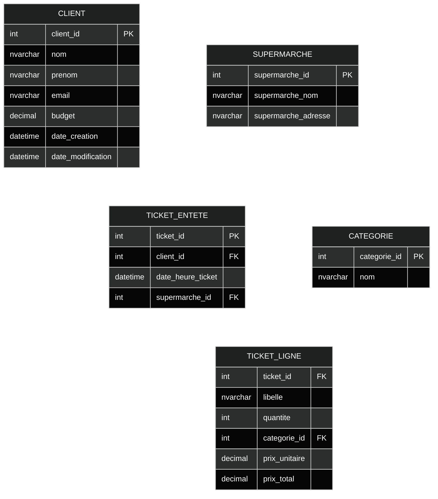

```mermaid
%%{init: {'theme': 'dark', 'themeVariables': { 
  'primaryColor': '#1E1E1E', 
  'secondaryColor': '#2D2D2D', 
  'tertiaryColor': '#3E3E3E', 
  'lineColor': '#FFFFFF', 
  'textColor': '#FFFFFF' 
}}}%%
erDiagram
    CLIENT {
        int client_id PK
        nvarchar nom
        nvarchar prenom
        nvarchar email
        decimal budget
        datetime date_creation
        datetime date_modification
    }

    SUPERMARCHE {
        int supermarche_id PK
        nvarchar supermarche_nom
        nvarchar supermarche_adresse
    }

    TICKET_ENTETE {
        int ticket_id PK
        int client_id FK
        datetime date_heure_ticket
        int supermarche_id FK
    }

    CATEGORIE {
        int categorie_id PK
        nvarchar nom
    }

    TICKET_LIGNE {
        int ticket_id FK
        nvarchar libelle
        int quantite
        int categorie_id FK
        decimal prix_unitaire
        decimal prix_total
    }

    CLIENT ||--o{ TICKET_ENTETE : ""
    SUPERMARCHE ||--o{ TICKET_ENTETE : ""
    TICKET_ENTETE ||--o{ TICKET_LIGNE : ""
    CATEGORIE ||--o{ TICKET_LIGNE : ""
```
