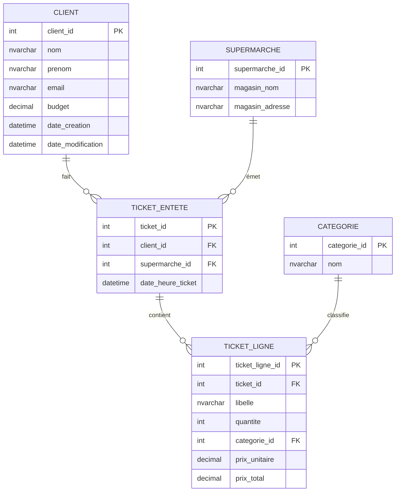

```mermaid
erDiagram
    CLIENT {
        int client_id PK
        nvarchar nom
        nvarchar prenom
        nvarchar email
        decimal budget
        datetime date_creation
        datetime date_modification
    }

    SUPERMARCHE {
        int supermarche_id PK
        nvarchar magasin_nom
        nvarchar magasin_adresse
    }

    TICKET_ENTETE {
        int ticket_id PK
        int client_id FK
        int supermarche_id FK
        datetime date_heure_ticket
    }

    CATEGORIE {
        int categorie_id PK
        nvarchar nom
    }

    TICKET_LIGNE {
        int ticket_ligne_id PK
        int ticket_id FK
        nvarchar libelle
        int quantite
        int categorie_id FK
        decimal prix_unitaire
        decimal prix_total
    }

    CLIENT ||--o{ TICKET_ENTETE : "fait"
    SUPERMARCHE ||--o{ TICKET_ENTETE : "émet"
    TICKET_ENTETE ||--o{ TICKET_LIGNE : "contient"
    CATEGORIE ||--o{ TICKET_LIGNE : "classifie"
```
