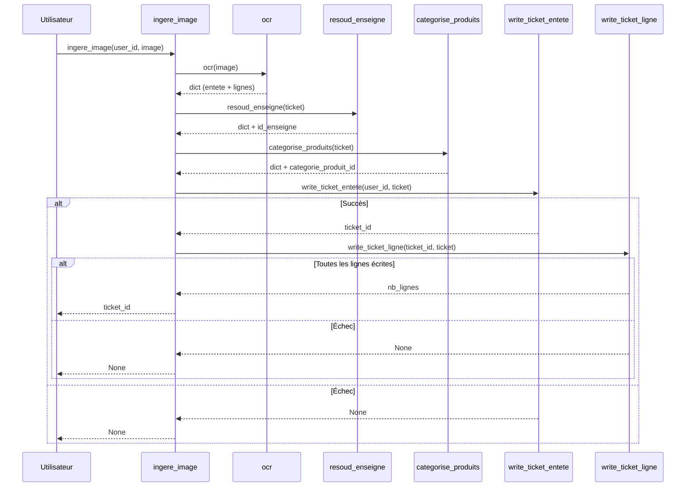

```mermaid
sequenceDiagram
    participant U as Utilisateur
    participant I as ingere_image
    participant O as ocr
    participant R as resoud_enseigne
    participant C as categorise_produits
    participant WE as write_ticket_entete
    participant WL as write_ticket_ligne

    U->>I: ingere_image(user_id, image)
    I->>O: ocr(image)
    O-->>I: dict (entete + lignes)
    I->>R: resoud_enseigne(ticket)
    R-->>I: dict + id_enseigne
    I->>C: categorise_produits(ticket)
    C-->>I: dict + categorie_produit_id
    I->>WE: write_ticket_entete(user_id, ticket)
    alt Succès
        WE-->>I: ticket_id
        I->>WL: write_ticket_ligne(ticket_id, ticket)
        alt Toutes les lignes écrites
            WL-->>I: nb_lignes
            I-->>U: ticket_id
        else Échec
            WL-->>I: None
            I-->>U: None
        end
    else Échec
        WE-->>I: None
        I-->>U: None
    end

```